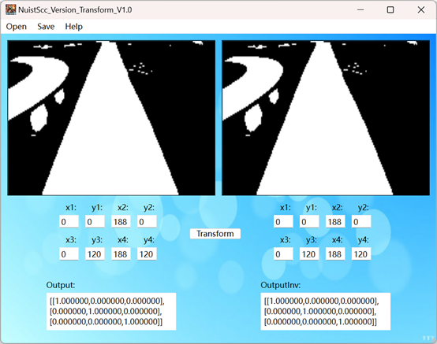
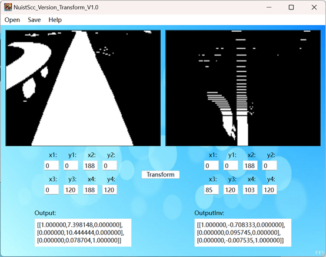

# NuistScc_Version_Transform

#### 介绍
NuistScc视觉组透视变换小工具

#### 部分界面展示

#### 使用方法
将.exe文件下载下来即可使用

#### 使用说明V1.0
1.仅适用于二值化图
 2.点击open打开图像后，透视变换前后的坐标会初始化为图像的四个角点，修改该角点可以对图像进行透视变换
###### 3.最下面两个框可以直接输出透视矩阵和逆矩阵
###### 4.点击save可以保存图片，可以选择保存原图还是透视之后的图片，保存路径可自己选择
###### 5.如有问题，点击help的contact可以联系作者
